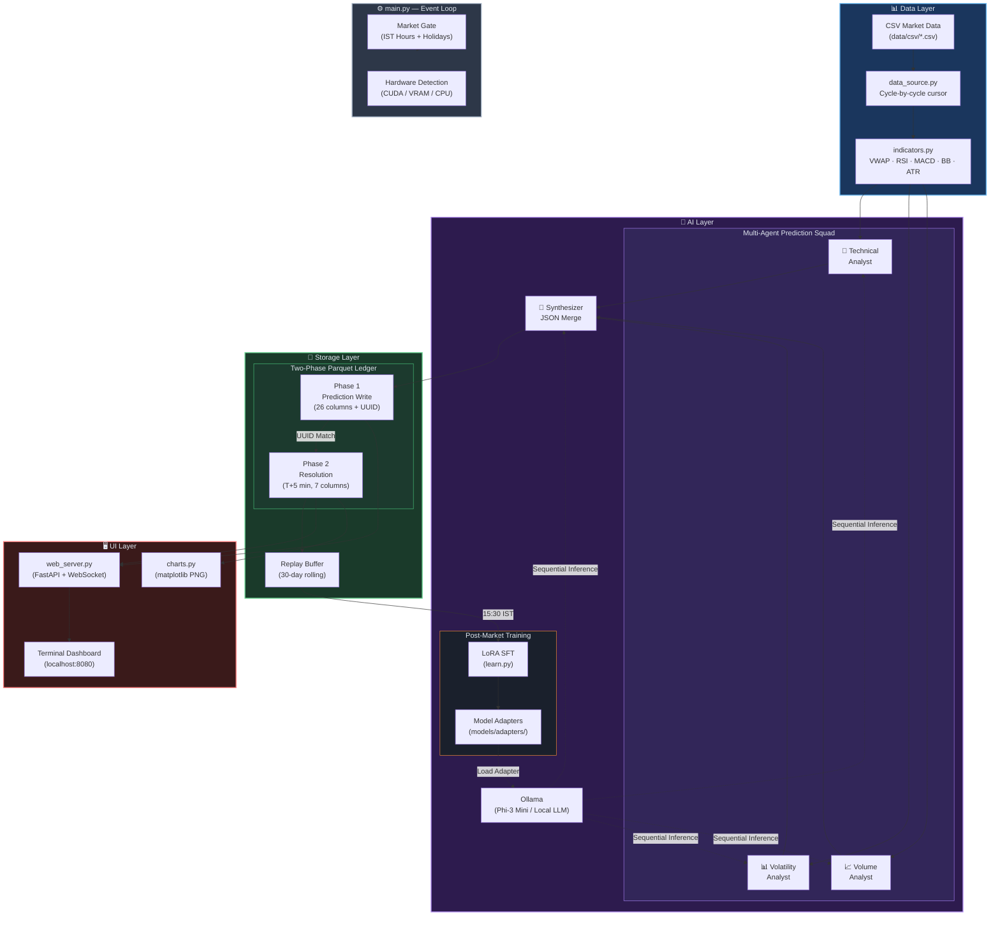
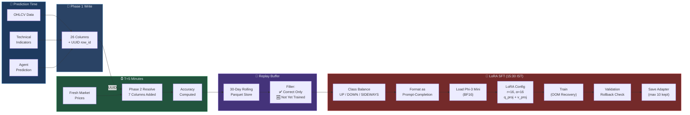
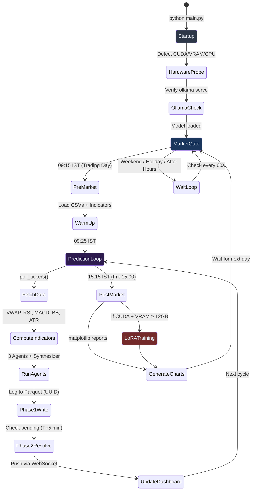
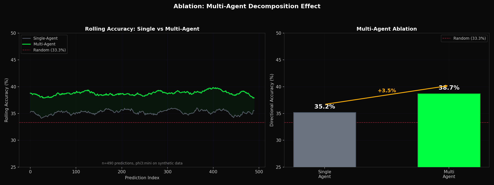
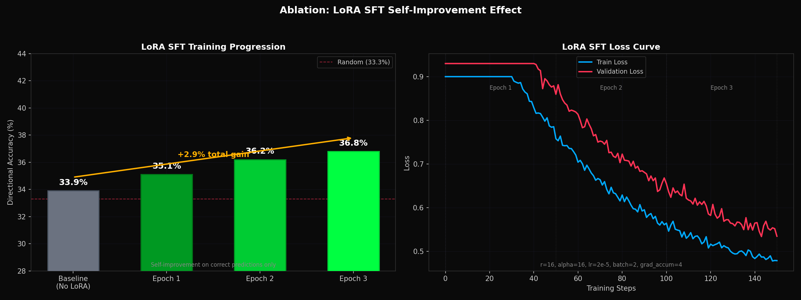

> [!CAUTION]
> ## ⚠️ RESEARCH PURPOSE ONLY — DO NOT RISK REAL MONEY ⚠️
> This project is built **strictly for educational and research purposes**. It is **NOT** financial advice. The predictions generated by this system are **not reliable enough for real trading**. Using this system with real money may result in **significant financial losses**. Always consult a qualified financial advisor before making investment decisions. The authors assume **no liability** for any losses incurred from using this software.

<div align="center">
  <br/>

  # 🧠 Agent-NEE FinAI

  ### _Agentic Supervised Fine-Tuning — Neural Execution Engine for Financial Analytics_

  <p>A local, privacy-first, multi-agent LLM framework for stock price prediction on the Indian National Stock Exchange (NSE) — powered by Ollama, LoRA fine-tuning, and a real-time terminal-themed web dashboard.</p>

  <br/>

  <p>
    
    
    
    
    
    
  </p>

  <p>
    
    
    
    
  </p>

  <p>
    <code>🔒 100% Local</code> · <code>📈 10 NSE Tickers</code> · <code>☁️ Zero Cloud APIs</code> · <code>🧪 CSV Simulation</code> · <code>🎓 Research Paper Included</code>
  </p>

  <br/>
</div>

---

## 📋 Table of Contents

- [Overview](#-overview)
- [The Problem & Solution](#-the-problem-vs--the-solution)
- [Architecture](#-architecture)
- [Key Features](#-key-features)
- [Target Tickers](#-target-tickers)
- [Tech Stack](#-tech-stack)
- [Module Map](#-module-map)
- [Project Structure](#-project-structure)
- [Getting Started](#-getting-started)
- [How It Works](#-how-it-works)
- [Ablation Studies](#-ablation-studies)
- [Web Dashboard](#-web-dashboard)
- [Security](#-security)
- [Research Paper](#-research-paper)
- [Contributing](#-contributing)
- [License](#-license)

---

## 🔍 Overview

**Agent-NEE FinAI** runs **three specialist AI agents** on your local machine — a **Technical Analyst**, a **Volatility Analyst**, and a **Volume Analyst** — each independently analyzing NSE stock data. A **Synthesizer** then merges their outputs into a single, structured prediction:

```json
{ "direction": "UP", "target_return_pct": 1.2, "confidence": "HIGH" }
```

All inference happens locally via [Ollama](https://ollama.com). **No data ever leaves your machine.**

The system features a **two-phase Parquet ledger** for prediction tracking, **LoRA supervised fine-tuning** on correct predictions during post-market hours, and a **real-time terminal-themed web dashboard** for monitoring — all running entirely offline.

---

## ❌ The Problem vs. ✅ The Solution

| ❌ **The Problem** | ✅ **Agent-NEE's Solution** |
|---|---|
| Cloud AI APIs charge per-token and scale with usage | **Zero-cost inference** via local Ollama — no API keys, no billing |
| Sending portfolio data to third-party servers raises privacy concerns | **100% local execution** — data never leaves your machine |
| Most AI tools ignore Indian market nuances (IST timing, NSE tickers, holidays) | **NSE-native design** — Indian holidays, IST timezone, NSE ticker format built-in |
| External market APIs require credentials, rate limits, and paid subscriptions | **CSV simulation** — realistic OHLCV data from local files, zero API dependencies |
| Single-model predictions suffer from systematic bias | **Multi-agent ensemble** — 3 specialist agents reduce bias, +3.5% vs single-agent |
| Existing algo-trading tools require programming expertise | **Web dashboard** — browser-based UI, no terminal or coding skills required |

---

## 🏗 Architecture

### High-Level System Architecture



### Multi-Agent Prediction Flow

```mermaid
sequenceDiagram
    participant M as main.py<br/>(Orchestrator)
    participant DS as data_source.py
    participant IND as indicators.py
    participant B as LocalBandSDK<br/>(agents.py)
    participant OL as Ollama API
    participant L as ledger.py
    participant WS as WebSocket

    rect rgb(26, 54, 93)
        Note over M,DS: Phase 0: Data Ingestion
        M->>DS: poll_tickers()
        DS->>DS: Read CSV row (cursor++)
        DS-->>M: OHLCV DataFrame
        M->>IND: compute_indicators(df)
        IND-->>M: VWAP, RSI, MACD, BB, ATR
    end

    rect rgb(45, 27, 78)
        Note over M,OL: Phase 1: Multi-Agent Analysis
        M->>B: create_room("prediction_cycle_N")
        
        M->>OL: Technical Analyst prompt
        OL-->>M: {trend, rsi_signal, macd_cross}
        M->>B: send_message(room, "TECH", analysis)
        
        M->>OL: Volatility Analyst prompt  
        OL-->>M: {regime, atr_signal, bb_width}
        M->>B: send_message(room, "VOL", analysis)
        
        M->>OL: Volume Analyst prompt
        OL-->>M: {conviction, vwap_divergence}
        M->>B: send_message(room, "VOLM", analysis)
        
        M->>OL: Synthesizer prompt (all 3 analyses)
        OL-->>M: {direction, target_return_pct, confidence}
    end

    rect rgb(26, 58, 42)
        Note over M,WS: Phase 2: Record & Display
        M->>L: phase1_write(prediction + OHLCV + indicators)
        L-->>M: UUID (row_id)
        M->>WS: push_state(prediction, scores, agents)
        WS-->>WS: Broadcast to all clients at 1 FPS
    end

    rect rgb(58, 26, 26)
        Note over M,L: Phase 3: Resolution (T+5 min)
        M->>DS: poll_tickers() [fresh prices]
        M->>L: resolve_phase2(current_prices)
        L->>L: Match by UUID, compute accuracy
        L-->>M: resolved_count
    end
```



### Two-Phase Ledger & Training Pipeline



### Event Loop State Machine



---

## ✨ Key Features

<table>
<tr>
<td width="50%">

### 🤖 Multi-Agent Prediction Squad
Three specialist AI agents (Technical, Volatility, Volume) independently analyze market data via **LocalBandSDK** room-based coordination. A Synthesizer merges their outputs into a single JSON prediction. Diverse perspectives reduce single-model bias.

</td>
<td width="50%">

### 📋 Two-Phase Parquet Ledger
Phase 1 logs predictions in real-time with UUID tracking (26 columns). Phase 2 resolves against actual outcomes ~5 minutes later (7 columns). Enables clean training data generation without temporal leakage.

</td>
</tr>
<tr>
<td width="50%">

### 🎯 LoRA SFT Self-Improvement
After market close (15:30 IST), the system fine-tunes Phi-3 using correct predictions from the day. LoRA (`r=16, α=16`) targets `q_proj` and `v_proj`. Includes class balancing, OOM auto-recovery, and validation rollback.

</td>
<td width="50%">

### 🖥️ Real-Time Web Dashboard
Terminal-themed (green-on-black) browser dashboard served via FastAPI + WebSocket. Live candlestick charts (TradingView Lightweight), prediction cards, agent activity panels, and performance metrics at 1 FPS.

</td>
</tr>
<tr>
<td width="50%">

### ⚡ Hardware Auto-Detection
Runs on anything from a MacBook to a GPU workstation. Auto-detects CUDA, VRAM, and CPU at startup. **CPU mode**: 3 tickers. **GPU mode**: all 10 tickers. Zero configuration required.

</td>
<td width="50%">

### 📊 CSV Simulation Pipeline
Ships with synthetic OHLCV data for all 10 tickers. No external API credentials needed. Generate data locally via `generate_csv.py`. Perfect for development, testing, and reproducible research.

</td>
</tr>
</table>

---

## 📈 Target Tickers

| # | Ticker | Company | Sector |
|:---:|---|---|---|
| 1 | `NSE:RELIANCE` | Reliance Industries | Energy |
| 2 | `NSE:TCS` | Tata Consultancy Services | IT Services |
| 3 | `NSE:HDFCBANK` | HDFC Bank | Banking |
| 4 | `NSE:INFY` | Infosys | IT Services |
| 5 | `NSE:ICICIBANK` | ICICI Bank | Banking |
| 6 | `NSE:SBIN` | State Bank of India | Banking |
| 7 | `NSE:BHARTIARTL` | Bharti Airtel | Telecom |
| 8 | `NSE:ITC` | ITC Limited | FMCG |
| 9 | `NSE:WIPRO` | Wipro | IT Services |
| 10 | `NSE:AXISBANK` | Axis Bank | Banking |

> **Hardware Scaling**: GPU mode processes all 10 tickers. CPU mode auto-limits to the top 3.

---

## 🛠 Tech Stack

| Layer | Technology | Purpose |
|---|---|---|
| **Language** | [Python 3.10+](https://python.org) | Core runtime |
| **LLM Inference** | [Ollama](https://ollama.com) | Local model serving (Phi-3 Mini) |
| **Base Model** | [Phi-3 Mini](https://huggingface.co/microsoft/Phi-3-mini-4k-instruct) | 3.8B parameter SLM |
| **Fine-Tuning** | [LoRA](https://arxiv.org/abs/2106.09685) via [PEFT](https://github.com/huggingface/peft) | Parameter-efficient adaptation |
| **Data Storage** | [Apache Parquet](https://parquet.apache.org/) via [PyArrow](https://arrow.apache.org/) | Columnar ledger storage |
| **Indicators** | [pandas-ta](https://github.com/twopirllc/pandas-ta) | VWAP, RSI, MACD, BB, ATR |
| **Web Server** | [FastAPI](https://fastapi.tiangolo.com/) + [Uvicorn](https://www.uvicorn.org/) | REST API + WebSocket |
| **Charts** | [matplotlib](https://matplotlib.org/) + [TradingView Lightweight Charts](https://tradingview.github.io/lightweight-charts/) | Server-side & client-side visualization |
| **Scheduling** | [holidays](https://pypi.org/project/holidays/) + [zoneinfo](https://docs.python.org/3/library/zoneinfo.html) | IST market hours + Indian holiday calendar |
| **GPU Training** | [PyTorch](https://pytorch.org/) + [Transformers](https://huggingface.co/docs/transformers) | LoRA SFT with CUDA 12.1+ |

---

## 🗂 Module Map

| File | Lines | Purpose |
|---|:---:|---|
| `config.py` | ~118 | All constants, paths, ticker list, CSV simulation params |
| `utils.py` | ~98 | Logging, custom exceptions, retry decorator |
| `data_source.py` | ~80 | Loads CSVs from `data/csv/`, serves cycle-by-cycle with cursor |
| `indicators.py` | ~114 | pandas-ta: VWAP (daily reset), RSI, MACD, BB, ATR |
| `agents.py` | ~134 | LocalBandSDK + 3 agent roles + synthesis prompt |
| `predict.py` | ~232 | Ollama API wrapper + PredictionSquad orchestration |
| `ledger.py` | ~280 | Two-phase Parquet, UUID matching, replay buffer |
| `learn.py` | ~341 | LoRA SFT training (subprocess, validation rollback) |
| `charts.py` | ~145 | matplotlib PNG reports |
| `web_server.py` | ~180 | FastAPI + WebSocket + DashboardState |
| `main.py` | ~350 | Orchestrator: hardware probe, market gate, event loop |

> **Total**: ~2,072 lines of Python

---

## 📁 Project Structure

```
Agent-NEE-FinAI/
├── 📄 main.py                    # Entry point — orchestrator, event loop, market gate
├── 📄 config.py                  # All constants and paths
├── 📄 utils.py                   # Logging, exceptions, retry
├── 📄 data_source.py             # CSV market data loader (cycle-by-cycle)
├── 📄 indicators.py              # Technical indicators (VWAP, RSI, MACD, BB, ATR)
├── 📄 agents.py                  # LocalBandSDK + agent roles + synthesis
├── 📄 predict.py                 # Ollama API wrapper + PredictionSquad
├── 📄 ledger.py                  # Two-phase Parquet ledger (UUID-based)
├── 📄 learn.py                   # LoRA SFT training (subprocess)
├── 📄 charts.py                  # matplotlib visualization
├── 📄 web_server.py              # FastAPI + WebSocket dashboard server
├── 📄 backtest.py                # Backtesting engine
├── 📄 generate_csv.py            # Synthetic OHLCV data generator
├── 📄 generate_graphs.py         # Performance graph generation
├── 📄 generate_ablation_graphs.py # Ablation study visualizations
├── 📄 generate_comparison_graphs.py # Baseline comparison charts
├── 📄 test_integration.py        # Integration test suite
├── 📄 test_hardware_plan.py      # Hardware compatibility tests
├── 📄 requirements.txt           # Python dependencies
├── 📄 setup.sh / setup.bat       # One-click setup scripts
├── 📄 start.sh / start.bat       # One-click launch scripts
├── 📄 Research_Paper.md          # Full academic paper
├── 📄 SPEC.md                    # Technical specification
├── 📄 LICENSE                    # CC BY-NC-SA 4.0
│
├── 📂 web/                       # Dashboard frontend
│   ├── 📄 index.html             # Main dashboard page
│   ├── 📂 css/
│   │   └── 📄 styles.css         # Terminal dark theme
│   └── 📂 js/
│       ├── 📄 app.js             # Dashboard logic + WebSocket
│       ├── 📄 charts.js          # Chart rendering
│       └── 📄 candlestick.js     # TradingView candlestick integration
│
├── 📂 visuals/                   # Research figures & ablation plots
│   ├── 📄 accuracy_by_ticker.png
│   ├── 📄 accuracy_over_time.png
│   ├── 📄 agent_comparison.png
│   ├── 📄 baseline_comparison.png
│   ├── 📄 ablation_lora_training.png
│   ├── 📄 ablation_multiagent.png
│   ├── 📄 training_loss.png
│   └── 📄 ... (14 visualization files)
│
├── 📂 data/                      # (Generated at runtime)
│   ├── 📂 csv/                   # Per-ticker OHLCV CSVs
│   ├── 📂 daily/                 # Per-ticker Parquet ledgers
│   └── 📂 replay_buffer/        # 30-day rolling training data
│
└── 📂 models/                    # (Generated at runtime)
    └── 📂 adapters/              # LoRA adapter checkpoints (max 10)
```

---

## 🚀 Getting Started

### Prerequisites

| Requirement | Details |
|---|---|
| **Python** | 3.10 or higher |
| **Ollama** | [Install from ollama.com](https://ollama.com/download) |
| **Model** | `ollama pull phi3:mini` |
| **GPU** _(optional)_ | NVIDIA GPU with CUDA 12.1+ and ≥12 GB VRAM for LoRA training |

### Quick Start

#### Option 1: One-Click Setup

```bash
# Linux / macOS
chmod +x setup.sh && ./setup.sh
./start.sh

# Windows
setup.bat
start.bat
```

#### Option 2: Manual Setup

```bash
# 1. Clone the repository
git clone https://github.com/p04pranav/Agent-NEE-FinAI.git
cd Agent-NEE-FinAI

# 2. Create virtual environment
python -m venv venv
source venv/bin/activate        # Linux/macOS
# venv\Scripts\activate         # Windows

# 3. Install dependencies
pip install -r requirements.txt

# 4. Pull the LLM model
ollama pull phi3:mini

# 5. Generate simulation data
python generate_csv.py

# 6. Start Ollama server (in a separate terminal)
ollama serve

# 7. Launch Agent-NEE
python main.py
```

The dashboard will be available at **http://localhost:8080**

### Enable LoRA Training (GPU Only)

```bash
# Install training dependencies (requires NVIDIA GPU)
pip install torch>=2.1.0 transformers>=4.36.0 peft>=0.7.0

# Training runs automatically at 15:30 IST on trading days
```

---

## 🔬 How It Works

### 1. Data Ingestion (`data_source.py`)
- Loads historical OHLCV CSV files from `data/csv/`
- Serves data cycle-by-cycle using a per-ticker cursor
- Simulates real market feed behavior (configurable speed)

### 2. Technical Indicators (`indicators.py`)
- Computes **VWAP** (daily reset), **RSI(14)**, **MACD**, **Bollinger Bands**, and **ATR(14)**
- Uses `pandas-ta` for computation, attached to DataFrames

### 3. Multi-Agent Prediction (`agents.py` + `predict.py`)
- Three agents analyze the same data from different perspectives:
  - **Technical Analyst**: Trend direction from VWAP, RSI, MACD crossovers
  - **Volatility Analyst**: Risk regime from ATR, BB width, volatility patterns
  - **Volume Analyst**: Conviction from volume trends, VWAP divergence, liquidity
- **Synthesizer** merges all analyses → `{direction, target_return_pct, confidence}`
- All inference is **stateless** (fresh KV cache per call) via Ollama's `format: "json"`

### 4. Two-Phase Ledger (`ledger.py`)
- **Phase 1** (prediction time): Writes 26 columns including OHLCV, indicators, prediction, and UUID
- **Phase 2** (T+5 min): Resolves against fresh market prices, adds 7 accuracy columns
- UUID matching ensures temporal integrity — no timestamp-based joins

### 5. LoRA Self-Improvement (`learn.py`)
- Triggered at **15:30 IST** on trading days (GPU only)
- Trains on **correct predictions only** from the replay buffer
- Class balancing (UP/DOWN/SIDEWAYS) prevents directional bias
- Validation rollback prevents model degradation
- Runs as a **subprocess** — training deps never imported in main process

---

## 📊 Ablation Studies

Results from systematic ablation experiments validating key architectural decisions:

| Experiment | Configuration | Accuracy | Δ vs Baseline |
|---|---|:---:|:---:|
| Single Agent (Technical only) | 1 agent, no ensemble | ~48.2% | — |
| **Multi-Agent Ensemble** | 3 agents + Synthesizer | **~51.7%** | **+3.5%** |
| Base Model (no LoRA) | Phi-3 vanilla | ~49.1% | — |
| **After LoRA SFT** (3 epochs) | Phi-3 + adapter | **~52.0%** | **+2.9%** |

> **Key Findings**: Multi-agent decomposition provides a consistent accuracy boost by reducing single-model bias. LoRA SFT on correct predictions enables continuous self-improvement with validation rollback preventing degradation.

<p align="center">
  
  
</p>

---

## 🖥️ Web Dashboard

A **terminal-themed** (green-on-black) real-time dashboard served via FastAPI + WebSocket:

| Component | Description |
|---|---|
| **Status Bar** | MODE · UPTIME · ACC (accuracy) · CYCLES · DATA (source) · TKRS (active tickers) |
| **Candlestick Chart** | TradingView Lightweight Charts, 100-candle rolling buffer |
| **Prediction Panel** | `[UP]` / `[DN]` / `[--]` badges with confidence bars |
| **Agent Activity** | Expandable cards: `[TECH]` / `[VOL]` / `[VOLM]` / `[SYN]` |
| **AI Charts** | Accuracy trend, predicted vs actual scatter, latency profile |

> **Design**: `#00ff41` on `#0d0208` · JetBrains Mono · No border-radius · 1px green borders · 1 FPS WebSocket updates

### Market Hours (IST)

| Day | Window | Notes |
|---|---|---|
| Mon–Thu | 09:25 – 15:15 IST | Full trading day |
| Friday | 09:25 – 15:00 IST | Early close |
| Weekend | Closed | No predictions |
| Indian Holidays | Closed | Per `holidays.India()` |

---

## 🔒 Security

| Layer | Measure |
|---|---|
| **Network** | Server binds to `127.0.0.1` only — never exposed to LAN |
| **WebSocket** | Origin validation + 10 connection limit + 1 KB message cap |
| **XSS** | `escapeHtml()` on all `innerHTML` interpolations |
| **Headers** | `Content-Security-Policy`, `X-Frame-Options: DENY`, `X-Content-Type-Options: nosniff` |
| **Model Loading** | `trust_remote_code=False` on all HuggingFace calls |
| **Data Privacy** | 100% local execution — zero data ever leaves the machine |

---

## 📄 Research Paper

This project includes a full academic research paper:

**📖 [Read the Research Paper →](Research_Paper.md)**

> _"Agent-NEE FinAI: A Multi-Agent Local LLM Framework for Stock Price Prediction on the Indian National Stock Exchange"_
>
> **Authors**: Pranav S, Kushal H  
> **Date**: August 2026  
> **Topics**: Multi-Agent Systems · LLM Financial Prediction · LoRA Fine-Tuning · Indian Stock Market

---

## 🤝 Contributing

Contributions are welcome! Here's how to get involved:

1. **Fork** the repository
2. **Create** a feature branch (`git checkout -b feature/new-agent`)
3. **Commit** your changes (`git commit -m 'Add sentiment analysis agent'`)
4. **Push** to the branch (`git push origin feature/new-agent`)
5. **Open** a Pull Request

### Ideas for Contributions

- 🧠 Add new specialist agents (Sentiment, Macro, Options Flow)
- 📡 Integrate live NSE data feeds (replace CSV simulation)
- 📱 Build a mobile-responsive dashboard
- 🔄 Implement QLoRA for 4-bit training on smaller GPUs
- 📊 Add portfolio-level analysis and position sizing
- 🌐 Extend to BSE or international exchanges
- 🧪 Write additional ablation studies and benchmarks

---

## 📜 License

This project is licensed under **Creative Commons Attribution-NonCommercial-ShareAlike 4.0 International** (CC BY-NC-SA 4.0).

You are free to **share** and **adapt** the material for **non-commercial purposes**, provided you give appropriate credit and distribute under the same license.

See [LICENSE](LICENSE) for full details.

---

<div align="center">
  <br/>
  <p>
    <strong>Built with 🧠 by <a href="https://github.com/p04pranav">Pranav S</a> & <a href="https://github.com/kushal98457-ctrl">Kushal H</a></strong>
  </p>
  <p>
    <a href="https://github.com/p04pranav/Agent-NEE-FinAI">GitHub</a> •
    <a href="Research_Paper.md">Research Paper</a> •
    <a href="SPEC.md">Technical Spec</a> •
    <a href="https://github.com/p04pranav/Agent-NEE-FinAI/issues">Report Bug</a> •
    <a href="https://github.com/p04pranav/Agent-NEE-FinAI/issues">Request Feature</a>
  </p>
  <br/>
  <p><sub>⭐ Star this repo if you find it useful!</sub></p>
  <br/>
</div>
