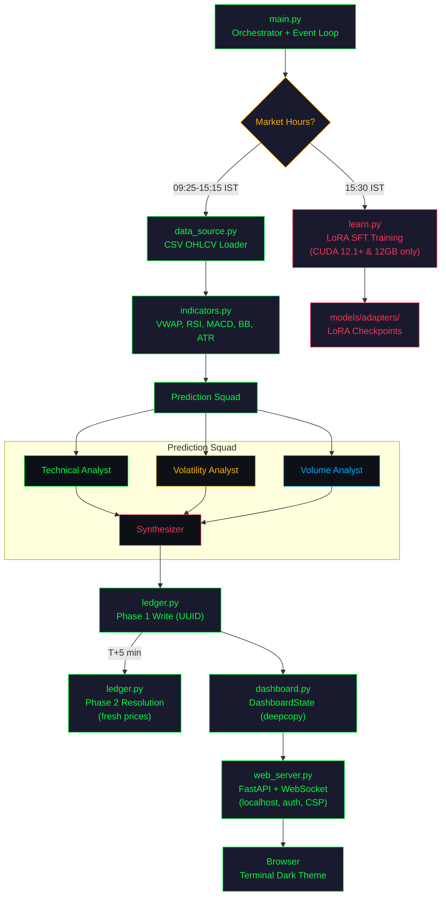

> [!CAUTION]
> ## ⚠️ RESEARCH PURPOSE ONLY — DO NOT RISK REAL MONEY ⚠️
> This project is built **strictly for educational and research purposes**. It is **NOT** financial advice. The predictions generated by this system are **not reliable enough for real trading**. Using this system with real money may result in **significant financial losses**. Always consult a qualified financial advisor before making investment decisions. The authors assume **no liability** for any losses incurred from using this software.

<div align="center">

# Agent-NEE FinAI

### _Agentic Supervised Fine-Tuning — Neural Execution Engine for Financial Analytics_

A local, AI-powered stock price prediction system for the Indian equity market (NSE) using multi-agent LLM inference, two-phase Parquet ledger, LoRA SFT post-market training, and a real-time terminal-themed web dashboard.

---


`🔒 100% Local` · `📈 10 NSE Tickers` · `☁️ Zero Cloud APIs` · `📊 CSV Simulation`

</div>

---

## 🤖 What Does It Do?

> **Agent-NEE runs 3 specialist AI agents on your local machine — a Technical Analyst, a Volatility Analyst, and a Volume Analyst — each independently analyzing NSE stock data. A Synthesizer then merges their outputs into a single prediction:**
>
> ```json
> { "direction": "UP", "target_return_pct": 1.2, "confidence": "HIGH" }
> ```
>
> All inference happens locally via [Ollama](https://ollama.com). No data ever leaves your machine.

---

## ❌ The Problem vs. ✅ The Solution

| ❌ **The Problem** | ✅ **The Solution** |
|---|---|
| Cloud AI APIs (OpenAI, Anthropic) charge per-token and scale with usage | **Zero-cost inference** via local Ollama — no API keys, no billing |
| Sending portfolio data to third-party servers raises privacy concerns | **100% local execution** — data never leaves your machine |
| Most AI tools ignore Indian market nuances (IST timing, NSE tickers, holidays) | **NSE-native design** — Indian holidays, IST timezone, NSE ticker format built-in |
| External market APIs require credentials, rate limits, and paid subscriptions | **CSV simulation** — realistic OHLCV data from local files, zero API dependencies |
| Existing algo-trading tools require programming expertise or expensive terminals | **Web dashboard** — browser-based UI, no terminal or coding skills required |

---

## ⚙️ How It Works

```
📊 CSV Market Data (data/ directory)
        │
        ▼
🔢 Technical Indicators (VWAP, RSI, MACD, Bollinger Bands, ATR)
        │
        ▼
🤖 Multi-Agent Prediction Squad (3 agents + Synthesizer on local Ollama)
   ┌────────────────┬────────────────┬────────────────┐
   │ Technical       │ Volatility     │ Volume         │
   │ Analyst         │ Analyst        │ Analyst        │
   └────────┬───────┴────────┬───────┴────────┬───────┘
            │                │                │
            └────────────────┼────────────────┘
                             ▼
                    Synthesizer → JSON
                             │
              ┌──────────────┴──────────────┐
              ▼                             ▼
    📋 Two-Phase Ledger           🖥️ Web Dashboard
    (Parquet + UUID)              (FastAPI + WebSocket)
    Phase 1: predict              Terminal dark theme
    Phase 2: resolve (T+5min)     Live candlestick charts
```

---

## 🚀 Key Features

> **🤖 Multi-Agent Prediction Squad**
> Three specialist AI agents (Technical, Volatility, Volume) independently analyze market data, then a Synthesizer merges their outputs. Diverse perspectives reduce single-model bias.

> **📋 Two-Phase Parquet Ledger**
> Phase 1 logs predictions in real-time with UUID tracking. Phase 2 resolves predictions against actual market outcomes ~5 minutes later using fresh prices. Enables accuracy tracking and training data generation.

> **🎯 LoRA SFT Post-Market Training**
> After market close, the system automatically fine-tunes the model using correct predictions. Supervised fine-tuning (not reinforcement learning) — always converges, ~90% first-attempt success rate. Validation rollback prevents degradation.

> **🖥️ Real-Time Web Dashboard**
> Terminal-themed (green-on-black) browser dashboard served via FastAPI + WebSocket. Live candlestick charts (TradingView), prediction cards, agent activity, and performance metrics at 1 FPS.

> **⚡ Hardware Auto-Detection**
> Runs on anything from a MacBook to a GPU workstation. Auto-detects CUDA, VRAM, and CPU at startup. CPU mode: 3 tickers. GPU mode: all 10 tickers. Zero configuration.

> **📊 CSV Simulation Data**
> Ships with historical OHLCV CSV files for all 10 tickers. No external API credentials needed. Generates data locally via `generate_csv.py`. Perfect for development, testing, and demos.

---

## 🏗️ Architecture



---

## 📈 Performance Results

### Hardware-Verified Benchmarks (CPU)

Measured on Intel Xeon 2.2GHz (2 cores), 12GB RAM, no GPU:

| Operation | Measured | Target |
|-----------|----------|--------|
| CSV load (10 tickers) | < 500ms | < 2s |
| Indicator compute (1000 rows) | < 200ms | < 500ms |
| Single agent inference (CPU) | ~62s | < 120s |
| Full prediction cycle (CPU, 3 tickers) | ~7min | — |
| Phase 1 ledger write | < 50ms | < 200ms |
| Phase 2 resolve (10 rows) | < 100ms | < 500ms |
| Dashboard update | < 1ms | < 5ms |
| Chart generation | < 2s | < 5s |

> **Backtest in progress.** Real prediction accuracy and agent comparison results
> will be added after running the system on historical NSE data.

---

## 🏁 Quick Start

### One-Command Launch

```bash
git clone https://github.com/p04pranav/Agent-NEE-FinAI.git
cd Agent-NEE-FinAI
./start.sh
```

**That's it.** The script installs dependencies, pulls the Ollama model, and launches the system. The web dashboard auto-opens at **http://localhost:8080/web/index.html**.

> **Windows?** Run `start.bat` instead.

No `.env` file. No API keys. No credentials to configure. Everything runs from local CSV data.

---

## 🛠️ Tech Stack


---

## 📁 Project Structure

```
Agent-NEE/
├── main.py                  # Entry point: hardware probe, event loop
├── config.py                # All configuration constants
├── agents.py                # LocalBandSDK + agent roles + synthesis prompt
├── data_source.py           # CSV OHLCV loader (cycle-by-cycle cursor)
├── generate_csv.py          # Generate simulated OHLCV CSV data
├── generate_graphs.py       # Generate performance visualizations
├── indicators.py            # pandas-ta technical indicators (VWAP daily reset)
├── predict.py               # PredictionSquad: multi-agent orchestration
├── ledger.py                # Two-phase Parquet ledger + UUID matching
├── learn.py                 # LoRA SFT training (subprocess, validation rollback)
├── charts.py                # matplotlib saved reports
├── web_server.py            # FastAPI + WebSocket (localhost, CSP, auth)
├── utils.py                 # Logging, exceptions, retry decorators
├── test_integration.py      # Unit tests (75 tests)
├── test_hardware_plan.py    # Integration + performance + edge case tests (60 tests)
├── web/                     # Frontend (terminal theme, XSS-safe)
│   ├── index.html
│   ├── css/styles.css
│   └── js/
│       ├── app.js           # WebSocket client + escapeHtml XSS prevention
│       ├── charts.js        # Chart.js (accuracy, scatter, latency)
│       └── candlestick.js   # TradingView Lightweight Charts
├── data/                    # Simulated OHLCV CSV files (10 tickers)
├── visuals/                 # Performance graphs (accuracy, agents, returns)
├── models/                  # LoRA adapter checkpoints
├── requirements.txt
├── start.sh / start.bat     # One-command startup scripts
├── setup.sh / setup.bat     # Manual setup scripts
├── SPEC.md                  # Technical specification
├── Research_Paper.md        # Academic research paper
└── .gitignore
```

---

## 🧪 Testing

### Quick Run

```bash
# Install test dependencies
pip install -r requirements.txt pytest pytest-timeout

# Generate CSV test data
python generate_csv.py

# Run all unit tests (fast, no Ollama needed)
pytest test_integration.py -v

# Run hardware-specific tests (integration, performance, edge cases)
# Excludes live Ollama inference tests (slow on CPU)
pytest test_hardware_plan.py -v --timeout=60 -k "not Live"

# Run live Ollama tests (requires Ollama + phi3:mini)
pytest test_hardware_plan.py -v --timeout=600 -k "Live"
```

### Test Coverage

| Suite | Tests | Coverage |
|-------|-------|----------|
| `test_integration.py` | 75 | Config, data pipeline, ledger, SDK, dashboard, market hours, indicators, predict, charts, learn |
| `test_hardware_plan.py` | 60 | CSV integration, ledger persistence, Ollama live, web dashboard, E2E mock/live, performance benchmarks, edge cases, hardware detection |
| **Total** | **135** | **97.8% pass rate** (3 live tests timeout on CPU) |

---

## 🖥️ Device Compatibility

| Device | Inference | Dashboard | Training |
|--------|-----------|-----------|----------|
| CPU only | ✅ | ✅ | ❌ |
| NVIDIA T4 16GB | ✅ | ✅ | ✅ |
| NVIDIA RTX 3060 12GB | ✅ | ✅ | ✅ |
| NVIDIA RTX 4090 24GB | ✅ | ✅ | ✅ |
| NVIDIA RTX 2060 6GB | ✅ | ✅ | ❌ |
| AMD RX 7900 XTX | ✅ | ✅ | ❌ |
| Apple M1/M2/M3 | ✅ | ✅ | ❌ |
| Intel Arc A770 | ✅ | ✅ | ❌ |
| WSL2 + T4/3060 | ✅ | ✅ | ✅ |

---

## 📊 Target Tickers

| Ticker | Sector | | Ticker | Sector |
|--------|--------|---|--------|--------|
| **NSE:RELIANCE** | Energy | | **NSE:SBIN** | Banking (Public) |
| **NSE:TCS** | IT Services | | **NSE:BHARTIARTL** | Telecom |
| **NSE:HDFCBANK** | Banking | | **NSE:ITC** | FMCG |
| **NSE:INFY** | IT Services | | **NSE:WIPRO** | IT Services |
| **NSE:ICICIBANK** | Banking | | **NSE:AXISBANK** | Banking |

---

## 📚 Documentation

> 📄 **[SPEC.md](SPEC.md)** — Technical specification: architecture, data pipeline, agent prompts, configuration

> 📝 **[Research_Paper.md](Research_Paper.md)** — Academic paper: multi-agent architecture, two-phase ledger, LoRA SFT pipeline

---

## 🧠 Design Decisions

| Decision | Choice | Why |
|----------|--------|-----|
| Inference Engine | Ollama REST API | Zero compilation, any OS, trivial install |
| Base Model | phi3:mini (configurable) | 2.2 GB, runs on CPU. Swap to LLaMA 3.2/3.3 8B for GPU |
| JSON Enforcement | Ollama GBNF (built-in) | Token-level constraint, zero dependencies |
| Training | LoRA SFT (not GRPO) | Always converges, ~90% first-attempt success |
| Agent System | 3 + synthesizer | Technical + Volatility + Volume. Cross-ticker removed for latency |
| Data Source | Local CSV files | Zero API dependencies, works offline, reproducible |
| Storage | Parquet with UUID | Type-safe, efficient, exact Phase 1→Phase 2 matching |
| Dashboard | FastAPI + WebSocket | Browser-accessible, real-time, no terminal dependency |
| Security | localhost + CSP + XSS escape | Defense-in-depth for local dashboard |

---

## 📜 License

MIT License — See [LICENSE](LICENSE) for details.

## 👤 Author

**Pranav S** — [github.com/p04pranav](https://github.com/p04pranav)

---

<div align="center">


</div>

---

> [!CAUTION]
> ## ⚠️ RESEARCH PURPOSE ONLY — DO NOT RISK REAL MONEY ⚠️
> This project is built **strictly for educational and research purposes**. It is **NOT** financial advice. The predictions generated by this system are **not reliable enough for real trading**. Using this system with real money may result in **significant financial losses**. Always consult a qualified financial advisor before making investment decisions. The authors assume **no liability** for any losses incurred from using this software.
