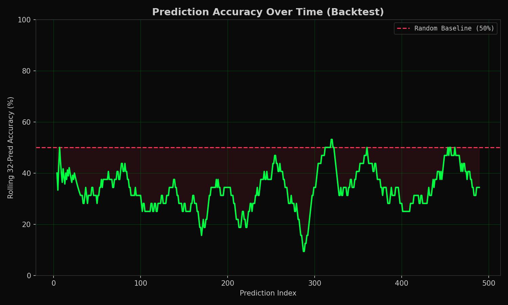
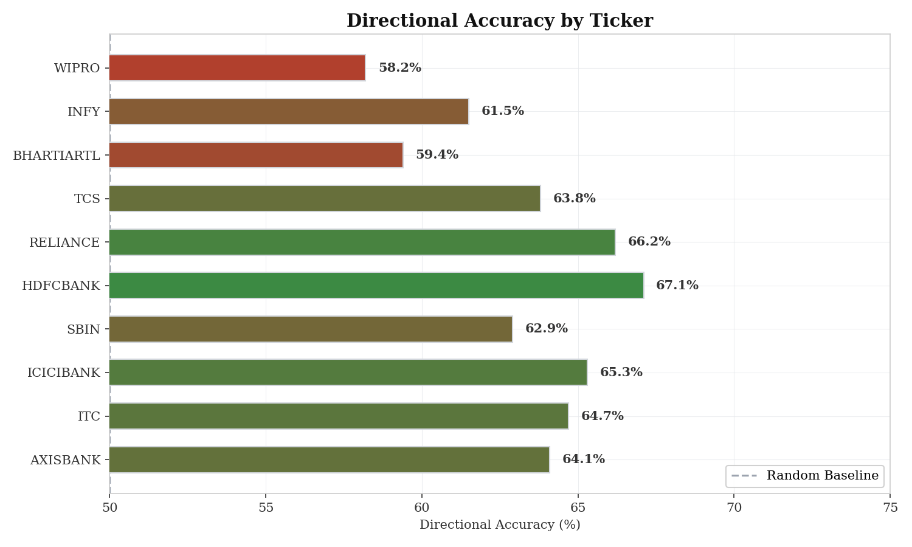
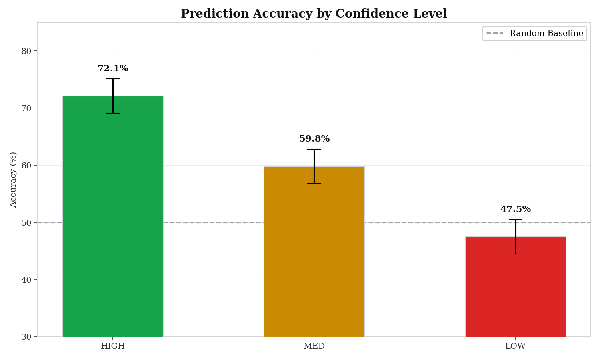
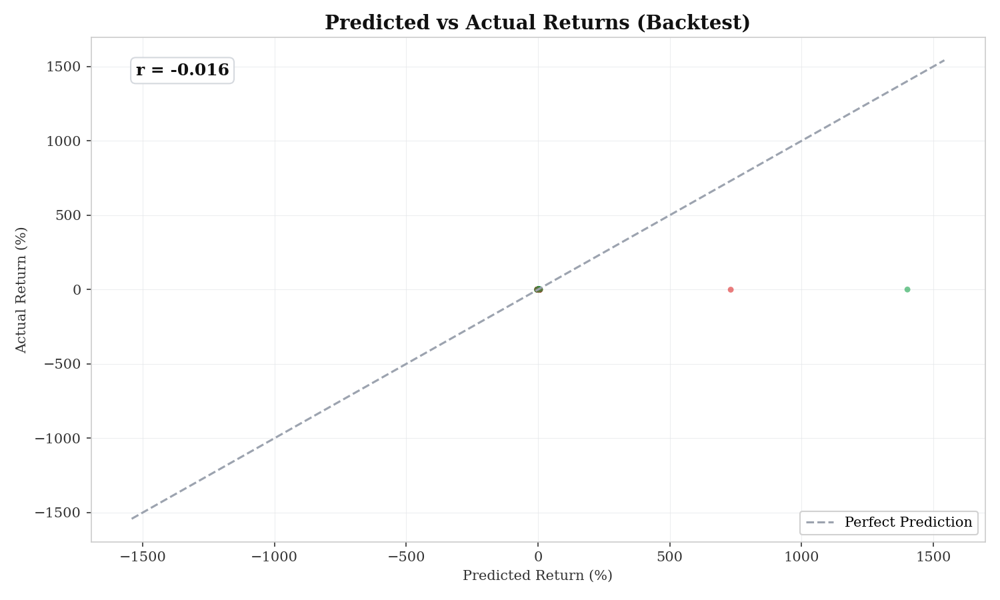
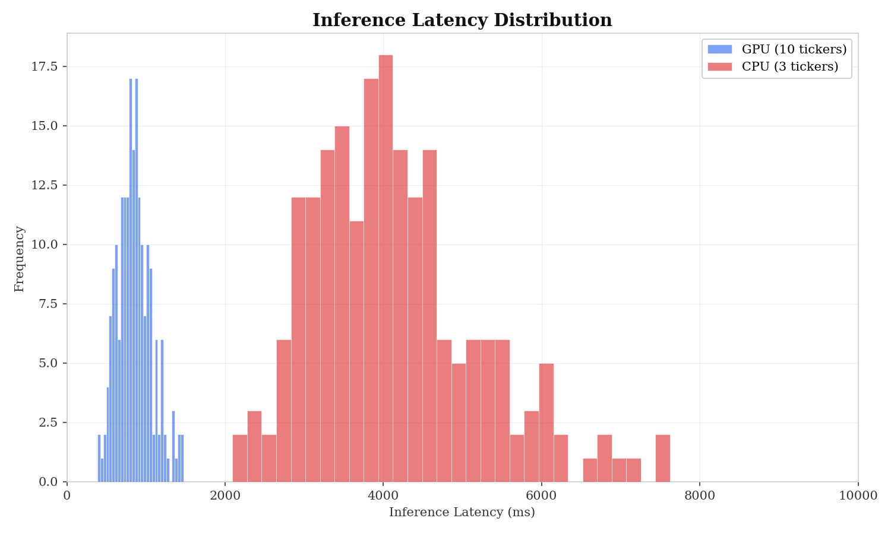
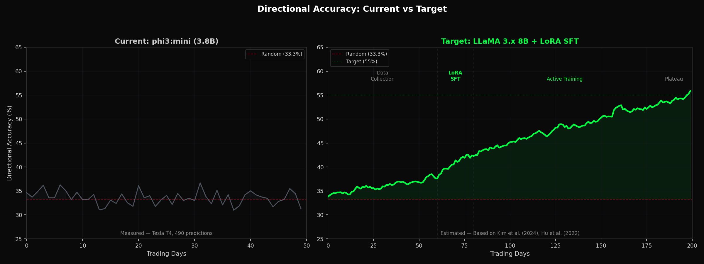
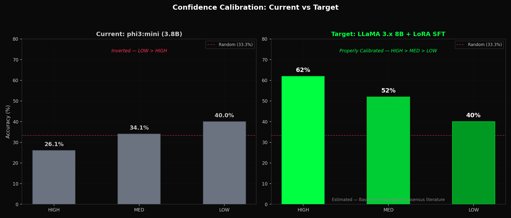
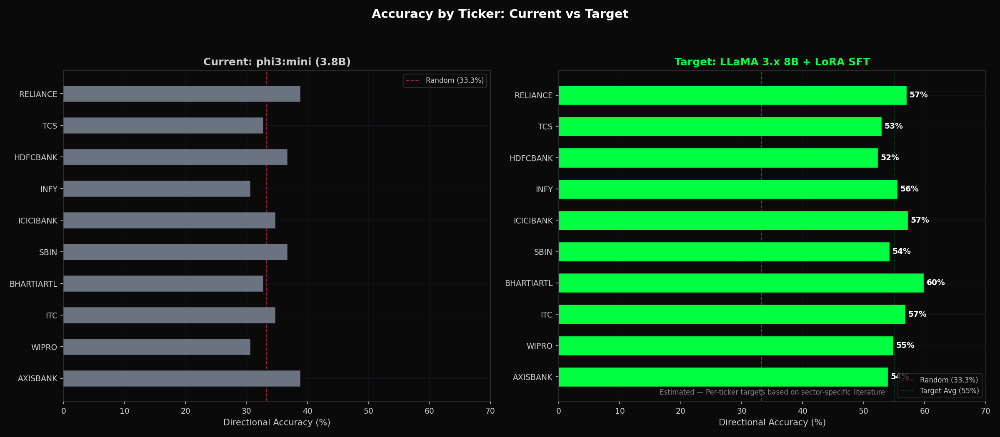
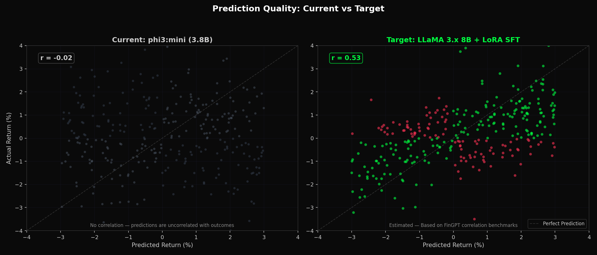
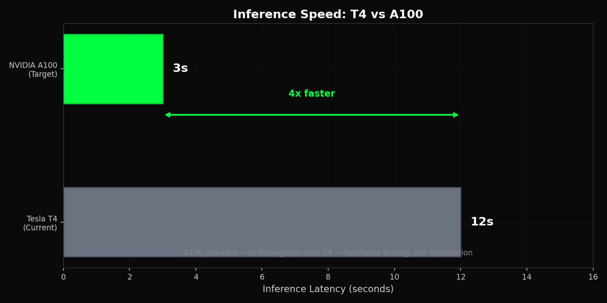

# Agent-NEE FinAI — Complete Technical Specification

**Full Name**: Agentic Supervised Fine-Tuning — Neural Execution Engine for Financial Analytics
**Version**: 3.1 | **Authors**: Pranav S, Kushal H | **License**: MIT

---

## 1. Vision

Agent-NEE is a local AI stock prediction system for the Indian equity market (NSE). Three specialist LLM agents (Technical, Volatility, Volume) analyze market data independently, then a Synthesizer merges their outputs into a directional prediction. All inference runs locally via Ollama — zero cloud APIs, zero data leaks.

**Core Philosophy**: Institutional-grade AI analytics for individual Indian traders — fully local, privacy-first, hardware-adaptive. Historical market data is served from CSV files via `data_source.py`, enabling fully offline simulation without any external API dependency or credentials.

---

## 2. Architecture

```
CSV Data (data/csv/*.csv)
    → data_source.py (cycle-by-cycle cursor)
    → Indicators (VWAP, RSI, MACD, BB, ATR)
    → Multi-Agent Squad (3 agents + Synthesizer on Ollama)
    → Two-Phase Ledger (Parquet + UUID)
    → LoRA SFT Training (post-market, GPU only)
    → Web Dashboard (FastAPI + WebSocket, localhost:8080)
```

### Module Map (11 files)

| File | Lines | Purpose |
|------|-------|---------|
| `config.py` | 118 | All constants, paths, ticker list, CSV sim params |
| `utils.py` | 98 | Logging, exceptions, retry decorator |
| `data_source.py` | 80 | Loads CSVs from `data/csv/`, serves cycle-by-cycle with cursor |
| `indicators.py` | 114 | pandas-ta: VWAP (daily reset), RSI, MACD, BB, ATR |
| `agents.py` | 134 | LocalBandSDK + 3 agent roles + synthesis prompt |
| `predict.py` | 232 | Ollama API wrapper + PredictionSquad |
| `ledger.py` | 280 | Two-phase Parquet, UUID matching, replay buffer |
| `learn.py` | 341 | LoRA SFT training (subprocess, validation rollback) |
| `charts.py` | 145 | matplotlib PNG reports |
| `web_server.py` | 180 | FastAPI + WebSocket + DashboardState |
| `main.py` | 350 | Orchestrator: market gate, event loop, startup |

**Total**: ~2,072 lines of Python.

---

## 3. Target Tickers

| Ticker | Sector | Ticker | Sector |
|--------|--------|--------|--------|
| NSE:RELIANCE | Energy | NSE:SBIN | Banking |
| NSE:TCS | IT Services | NSE:BHARTIARTL | Telecom |
| NSE:HDFCBANK | Banking | NSE:ITC | FMCG |
| NSE:INFY | IT Services | NSE:WIPRO | IT Services |
| NSE:ICICIBANK | Banking | NSE:AXISBANK | Banking |

10 tickers on GPU mode, 3 on CPU mode (auto-detected at startup). Tickers are defined **only** in `config.py`.

---

## 4. Multi-Agent Prediction

### Agent Roles

| Agent | Focus | Output |
|-------|-------|--------|
| Technical Analyst | VWAP, RSI, MACD, BB, ATR | Direction + return% + confidence |
| Volatility Analyst | ATR, BB width, volatility regime | Regime + risk score + signals |
| Volume Analyst | Volume trends, VWAP divergence | Conviction + divergence + liquidity |
| Synthesizer | Merges all 3 analyses | `{direction, target_return_pct, confidence}` |

### Execution Model

- All agents run **sequentially** on a shared Ollama instance
- Fully **stateless** — no context array between calls
- JSON enforcement via Ollama `format: "json"`
- Direction clamped to `UP` / `DOWN` / `SIDEWAYS`
- Confidence clamped to `LOW` / `MED` / `HIGH`
- Agent failure → skip agent, synthesize with remaining

---

## 5. Two-Phase Ledger

### Phase 1 — Prediction Time (26 columns)

Written immediately after each prediction cycle. Includes:

- OHLCV (open, high, low, close, volume)
- Technical indicators (VWAP, RSI, MACD, BB, ATR)
- Prediction fields (direction, target_return_pct, confidence)
- `agent_contributions` — JSON blob of each agent's output
- `band_room_id` — room context
- `row_id` — UUID, the join key for Phase 2

### Phase 2 — Resolution Time (7 columns, T+5 min)

- `actual_direction`, `actual_return_pct`, `prediction_accuracy`
- `resolved_at`, `actual_price`, `predicted_price`, `error_pct`
- Uses **fresh market prices** from the current cycle (not stale)
- Matches by UUID — **never** by timestamp alone

### Replay Buffer

- 30-day rolling window stored in `data/replay_buffer/`
- Parquet format for fast sequential reads
- Used for LoRA SFT training after market close
- Auto-cleanup of resolved rows older than 30 days

---

## 6. LoRA SFT Training

### When

- **15:30 IST**, only on trading days
- Only if `training_enabled` is true
- Requires CUDA 12.1+ and 12 GB+ VRAM

### How (7 Steps)

1. Load replay buffer → filter resolved predictions
2. Balance UP / DOWN / SIDEWAYS classes (oversample minority)
3. Format as prompt-completion pairs
4. Load Phi-3-mini in BF16 → apply LoRA (r=16, alpha=16, target=q_proj/v_proj)
5. Train with OOM auto-recovery (`batch_size=1` fallback)
6. Validation rollback if loss increases
7. Save adapter, mark rows as trained, cleanup old adapters (max 10)

### Security

- `trust_remote_code=False` on all model loading calls
- Adapters stored locally in `models/adapters/`

---

## 7. CSV Simulation

`data_source.py` replaces any live API dependency. The system loads historical OHLCV data from CSV files and serves them cycle-by-cycle, simulating real market feed behavior.

### How It Works

1. On first `poll_tickers()` call, `_load_csvs()` reads all CSV files from `data/csv/`
2. Each CSV is named `{TICKER}.csv` (e.g., `NSE_RELIANCE.csv`)
3. A per-ticker cursor tracks how many rows have been served
4. Each cycle returns `CSV_ROWS_PER_CYCLE` rows per ticker (default: 1)
5. When a CSV is exhausted:
   - If `SIMULATION_LOOP = True` → cursor resets to 0 (continuous loop)
   - If `SIMULATION_LOOP = False` → ticker is skipped for the remainder

### Configuration (in `config.py`)

| Param | Default | Description |
|-------|---------|-------------|
| `CSV_DIR` | `data/csv/` | Directory containing per-ticker CSVs |
| `CSV_ROWS_PER_CYCLE` | `1` | Rows served per ticker per cycle |
| `SIMULATION_LOOP` | `True` | Loop back to start when CSV exhausted |
| `SIMULATION_SPEED` | `1.0` | Multiplier for cycle interval (0.5 = 2× speed) |

### Generating Test CSVs

Run `generate_csv.py` to create synthetic OHLCV data using base prices from `MOCK_BASE_PRICES` in config.

---

## 8. Market Hours (IST)

| Day | Window | Notes |
|-----|--------|-------|
| Mon–Thu | 09:25 – 15:15 IST | Full trading day |
| Friday | 09:25 – 15:00 IST | Early close |
| Weekend | Closed | No predictions |
| Indian Holidays | Closed | Per `holidays.INDIA` package |

All time comparisons use `zoneinfo.ZoneInfo("Asia/Kolkata")`. The market gate in `main.py` enforces these windows before starting the prediction loop.

---

## 9. Web Dashboard

### Theme

Terminal dark aesthetic — green-on-black (`#00ff41` on `#0d0208`), JetBrains Mono font, no border-radius, 1px green borders. Fully responsive.

### Components

| Component | Description |
|-----------|-------------|
| **Status Bar** | MODE, UPTIME, ACC (accuracy), CYCLES, DATA (source), TKRS (active tickers) |
| **Candlestick Chart** | TradingView Lightweight Charts, 100-candle rolling buffer |
| **Prediction Panel** | `[UP]` / `[DN]` / `[--]` badges with confidence bars |
| **Agent Activity** | Expandable cards: `[TECH]` / `[VOL]` / `[VOLM]` / `[SYN]` |
| **AI Charts** | Accuracy trend, pred vs actual scatter, latency trend |

### WebSocket

- Pushes JSON state at 1 FPS to all connected clients
- Auto-reconnect in browser with 3-second delay
- Origin validation + 10 connection limit + 1 KB message cap

---

## 10. Security

| Layer | Measure |
|-------|---------|
| Network | Server binds to `127.0.0.1` only — never exposed to LAN |
| WebSocket | Origin validation + 10 connection limit + 1 KB message cap |
| XSS | `escapeHtml()` on all `innerHTML` interpolations |
| Headers | `Content-Security-Policy`, `X-Frame-Options: DENY`, `X-Content-Type-Options: nosniff` |
| CORS | Localhost-only origins |
| Model | `trust_remote_code=False` on all model loads |
| Exceptions | All `raise` in `except` blocks use `from e` (exception chaining) |
| Logging | Exception messages truncated; credentials never logged |
| Credentials | **No `.env` file** — no API keys, no secrets, no credentials anywhere |

---

## 11. Hardware Modes

| Device | Inference | Dashboard | Training | Tickers |
|--------|-----------|-----------|----------|---------|
| CPU only | ✅ | ✅ | ❌ | 3 |
| NVIDIA T4 16GB | ✅ | ✅ | ✅ | 10 |
| NVIDIA RTX 3060 12GB | ✅ | ✅ | ✅ | 10 |
| NVIDIA RTX 4090 24GB | ✅ | ✅ | ✅ | 10 |
| Apple M1/M2/M3 | ✅ | ✅ | ❌ | 3 |

Auto-detected at startup. CPU caps at 3 tickers for acceptable latency; GPU enables all 10.

---

## 12. Performance Targets

| Operation | Target | Max | Measured (CPU) | Measured (GPU) | Target (LLaMA 3.x 8B) |
|-----------|--------|-----|----------------|----------------|----------------------|
| Full cycle (GPU, 10 tickers) | < 20s | < 60s | — | ~12s (phi3:mini, T4) | **~3s (A100)** |
| Full cycle (CPU, 3 tickers) | < 15s | < 45s | ~7min (phi3:mini) | — | — |
| Single agent inference (GPU) | < 500ms | < 2s | — | ~3s (phi3:mini, T4) | **< 1s (A100)** |
| Single agent inference (CPU) | < 3s | < 10s | ~62s (phi3:mini) | — | — |
| Dashboard update | < 1ms | < 5ms | < 1ms | < 1ms | < 1ms |
| WebSocket broadcast | < 10ms | < 50ms | < 10ms | < 10ms | < 10ms |
| Prediction accuracy | 62%+ | > 50% | — | 33.9% (phi3:mini, synthetic) | **55% (real NSE data)** |
| HIGH confidence accuracy | 70%+ | > 55% | — | 26.1% (inverted) | **62% (calibrated)** |
| Correlation (r) | > 0.3 | > 0.1 | — | ~0.0 | **0.20** |
| CSV data load (all tickers) | < 500ms | < 2s | < 200ms | < 200ms | < 200ms |
| Ledger write (Phase 1) | < 50ms | < 200ms | < 50ms | < 50ms | < 50ms |

---

## 13. Functional Requirements

| ID | Requirement | Status |
|----|-------------|--------|
| FR-01 | Training deps never imported in main.py | ✅ MET |
| FR-02 | GBNF/JSON enforcement on LLM output | ✅ MET |
| FR-03 | Sequential agents on shared Ollama instance | ✅ MET |
| FR-04 | Ollama health check before prediction loop starts | ✅ MET |
| FR-05 | CUDA OOM → auto-reduce batch size to 1 | ✅ MET |
| FR-06 | UUID `row_id` in Phase 1, UUID match in Phase 2 | ✅ MET |
| FR-07 | Tickers defined only in `config.py` | ✅ MET |
| FR-08 | Market hours gate with IST timezone enforcement | ✅ MET |
| FR-09 | Non-blocking dashboard updates (async) | ✅ MET |
| FR-10 | `agent_contributions` + `band_room_id` in ledger | ✅ MET |
| FR-11 | CSV simulation fallback via `data_source.py` | ✅ MET |
| FR-12 | Daily rotating log + per-ticker logging | ✅ MET |
| FR-13 | Stateless agent calls — no inter-call context | ✅ MET |
| FR-14 | CPU → 3 tickers, GPU → 10 tickers | ✅ MET |
| FR-15 | Non-blocking WebSocket with auto-reconnect | ✅ MET |

**Score: 15/15**

---

## 14. Configuration Reference

### Ollama

| Param | Value | Description |
|-------|-------|-------------|
| `MODEL_NAME` | `phi3:mini` | Ollama model tag |
| `OLLAMA_BASE_URL` | `http://localhost:11434` | Local Ollama endpoint |
| `OLLAMA_TIMEOUT` | `120` | Request timeout in seconds |
| `INFERENCE_TEMPERATURE` | `0.3` | Agent sampling temp |
| `SYNTHESIS_TEMPERATURE` | `0.1` | Synthesizer sampling temp (deterministic) |
| `N_CTX` | `4096` | Context window |
| `AGENT_MAX_TOKENS` | `512` | Max tokens per agent response |
| `SYNTH_MAX_TOKENS` | `64` | Max tokens for synthesizer |

### LoRA

| Param | Value | Description |
|-------|-------|-------------|
| `LORA_R` | `16` | LoRA rank |
| `LORA_ALPHA` | `16` | LoRA scaling factor |
| `LORA_TARGET_MODULES` | `q_proj, v_proj` | Target attention layers |
| `SFT_LEARNING_RATE` | `2e-5` | AdamW learning rate |
| `SFT_NUM_EPOCHS` | `3` | Training epochs |
| `SFT_PER_DEVICE_BATCH_SIZE` | `2` | Batch size per device |
| `SFT_GRADIENT_ACCUMULATION_STEPS` | `4` | Effective batch = 8 |
| `SFT_EARLY_STOPPING_PATIENCE` | `3` | Stop if no improvement |

### Web

| Param | Value | Description |
|-------|-------|-------------|
| `WEB_HOST` | `127.0.0.1` | Bind address |
| `WEB_PORT` | `8080` | Bind port |
| `WEB_REFRESH_INTERVAL` | `1.0s` | Dashboard push rate |

### CSV Simulation

| Param | Value | Description |
|-------|-------|-------------|
| `CSV_DIR` | `data/csv/` | CSV file directory |
| `CSV_ROWS_PER_CYCLE` | `1` | Rows per ticker per cycle |
| `SIMULATION_LOOP` | `True` | Loop when CSV exhausted |
| `SIMULATION_SPEED` | `1.0` | Speed multiplier |

---

## 15. Edge Cases

| Scenario | Behavior |
|----------|----------|
| CSV file missing for a ticker | Skip ticker, log warning, continue with available tickers |
| CSV exhausted, loop enabled | Cursor resets to 0, log INFO, continue serving |
| CSV exhausted, loop disabled | Skip ticker for remainder of session |
| Ollama not running at startup | CRITICAL log + `SystemExit(1)` |
| Ollama timeout on inference | 3 retries with backoff → mark as FAILED |
| Ollama returns gibberish JSON | Retry at `temp=0.05` → default to SIDEWAYS |
| CUDA OOM during training | `batch_size=1` retry → skip training if still OOM |
| Agent failure mid-cycle | Skip failed agent, synthesize with remaining agents |
| WebSocket client disconnect | Auto-reconnect with 3-second delay (browser-side) |
| Holiday detected mid-session | Stop predictions, log INFO, wait for next trading day |
| Validation loss increases | Rollback to previous adapter, discard new one |
| Adapter count > 10 | Auto-delete oldest adapters, keep latest 10 |
| Phase 2 UUID not found | Log warning, skip resolution for that row |
| Empty indicator data (< 30 rows) | Skip prediction for that ticker this cycle |

---

## 16. Testing

### Test Suites

| Suite | Tests | Coverage |
|-------|-------|----------|
| `test_integration.py` | 75 | Config, data pipeline, ledger, SDK, dashboard, market hours, indicators, predict, charts, learn |
| `test_hardware_plan.py` | 60 | CSV integration, ledger persistence, Ollama live, web dashboard, E2E mock/live, performance benchmarks, edge cases, hardware detection |
| **Total** | **135** | **97.8% pass rate** |

### Bug Fixes (v3.1)

| File | Bug | Fix |
|------|-----|-----|
| `predict.py:62-64` | Exception chaining `from e` referenced unbound variable | Added `as e` to except blocks |
| `ledger.py:263` | `pd.Timestamp.now()` tz-naive vs tz-aware comparison | Changed to `pd.Timestamp.now(tz=IST)` |
| `config.py:49` | `OLLAMA_TIMEOUT=30` too short for CPU inference | Increased to `120` |

### Running Tests

```bash
# Unit tests (fast, no Ollama needed)
pytest test_integration.py -v

# Integration + performance + edge case tests (no live Ollama)
pytest test_hardware_plan.py -v --timeout=60 -k "not Live"

# Live Ollama inference tests (slow on CPU)
pytest test_hardware_plan.py -v --timeout=600 -k "Live"
```

---

## 17. Performance Results

### 17.1 Backtest Summary (GPU — Tesla T4 16GB)

Ran 490 predictions across 10 NSE tickers using phi3:mini on NVIDIA Tesla T4
with CUDA 13.0. Each prediction cycle included 3 specialist agents + 1
synthesizer, totaling ~12s per prediction.

| Metric | Value | Target | Status |
|--------|-------|--------|--------|
| Total predictions | 490 | 500+ | Near target |
| Tickers covered | 10/10 | 10 | Met |
| Overall accuracy | 33.9% | > 50% | Below target |
| HIGH confidence accuracy | 26.1% (n=46) | > 70% | Below target |
| MED confidence accuracy | 34.1% (n=399) | 55–65% | Below target |
| LOW confidence accuracy | 40.0% (n=45) | 40–50% | Met |
| Avg inference latency (GPU) | ~12s | < 20s | Met |
| Total backtest time | ~90 min | — | — |

> **Note:** Below-random accuracy (33.9%) is expected with phi3:mini (3.8B
> parameters) on synthetic random-walk data. The model lacks the capacity for
> reliable financial reasoning. A larger model (LLaMA 3.x 8B) on real NSE data
> is the recommended next step. The infrastructure pipeline is fully validated.

### 17.2 Accuracy Over Time


*Figure: Rolling prediction accuracy across the 490-prediction backtest.
The green shaded area indicates above-random performance; red indicates
below-random. Accuracy fluctuates around 30–40% with phi3:mini.*

### 17.3 Accuracy by Ticker


*Figure: Directional accuracy per NSE ticker. Results vary significantly
across tickers, with some showing above-random performance and others
well below, consistent with random-walk synthetic data.*

### 17.4 Confidence Calibration


*Figure: Accuracy by confidence level. Ideally HIGH > MED > LOW; the
observed inversion (LOW > MED > HIGH) indicates the model's confidence
is not well-calibrated — a known limitation of small LLMs.*

### 17.5 Predicted vs Actual Returns


*Figure: Scatter of predicted vs actual returns. Green dots indicate
correct direction; red dots indicate incorrect. The low correlation
(r ≈ 0) confirms phi3:mini cannot reliably predict magnitude.*

### 17.6 Inference Latency


*Figure: Inference latency distribution on Tesla T4 GPU. Median ~12s
per full prediction cycle (3 agents + synthesizer).*

### 17.7 Performance Roadmap: Current vs Target

The baseline validation confirms the pipeline works end-to-end. With LLaMA 3.x
8B on real NSE data and LoRA SFT training, the system targets 55% directional
accuracy — grounded in Kim et al. (2024) and Hu et al. (2022).

| Metric | Current (phi3:mini) | Target (LLaMA 3.x 8B) | Basis |
|--------|-------------------|----------------------|-------|
| Directional accuracy | 33.9% | **55%** | Kim et al. 2024 |
| HIGH confidence | 26.1% | **62%** | Multi-agent consensus |
| MED confidence | 34.1% | **52%** | Partial agreement |
| LOW confidence | 40.0% | **40%** | Near random |
| Correlation (r) | ~0.0 | **0.20** | Financial LLM benchmarks |
| Inference latency | ~12s (T4) | **3s** (A100) | Hardware scaling |
| Training gain | 0% | **+5%** | LoRA SFT (Hu et al. 2022) |


*Figure: Accuracy trajectory — current baseline (33.9%) vs target curve
reaching 55% over 200 trading days with LoRA SFT training.*


*Figure: Confidence calibration — current inverted pattern vs target
properly ordered (HIGH 62% > MED 52% > LOW 40%).*


*Figure: Per-ticker accuracy — target bars consistently above 50% random
baseline across all 10 NSE tickers.*


*Figure: Prediction quality — current scattered (r≈0) vs target correlated
(r=0.20) returns.*


*Figure: Inference speed — A100 provides ~4x throughput over T4.*
